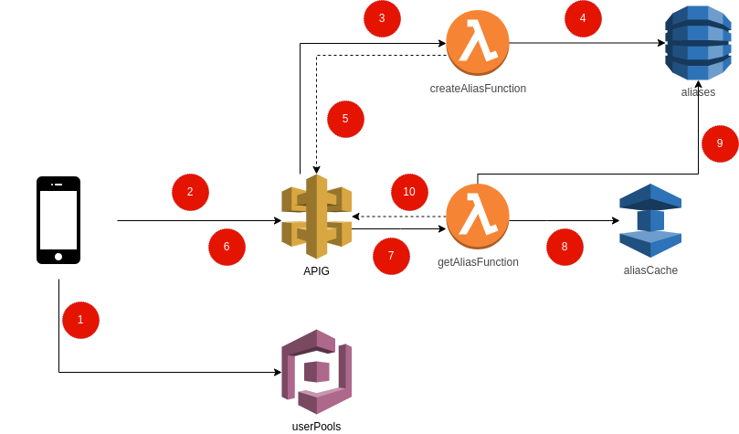

# Introdução
O objetivo este exercício é o de criar uma aplicação real na AWS. Este exercício será quebrado em objetivos menores e você só deverá ir para o próximo exercício quando terminar e testar o exercício anterior.

# Antes e começar
Para esse exercício estamos deixando uma Cognito UserPools já configurada para você usar em sua aplicação.

## Objetivo 1
### Arquitetura


### Descrição
1. Aplicação cria/loga usuário usando URL de autenticação do cognito (veja Output **BitlyAuthURL**). Após se logar, o domínio do cognito chamará a URL de callback que redirecionará para a aplicação do cliente com os seguintes query parameters: **id_token**, **expires_in** e **token__type**.
2. Após o login, a aplicação faz uma chamada de **POST** para o Api Gateway e informa a URL que deverá ser encurtada.
3. Se o token de autenticação for válido, o Api Gateway chama a Lambda **createAliasFunction**. Esta Lambda criará um valor aleatório de 8 caracteres e verificará se este valor não existe no DynamoDB **aliases**. Se existir, ela deverá gerar outro valor.
4. Se o valor não existir, a lambda **createAliasFunction** deverá salvar o dado no DynamoDB.
5. **CreateAliasFunction** retorna um body com o caminho que o usuário deverá acessar para chamar a URL encurtada.
6. Usuário acessa a URL retornada pelo passo anterior (https://{domínio_do_APIG}/{alias}). Esta URL será um caminho de **GET** no API Gateway.
7. APIG chama a função **getAliasFunction** para procurar o alias.
8. **getAliasFunction** procura alias no DynamoDB **aliases**. Se achar, irá redirecionar para a URL.
Se não achar, ela deverá retornar um erro **404 (Not Found)**.

### Objetivos
#### 1. Adicionar o Cognito UserPools em sua Stack
Copiei as seguintes configurações em seu arquivo de template:

```yaml
  BitlyUserPool:
    Type: AWS::Cognito::UserPool
    Properties:
      UserPoolName: !Sub '${AWS::StackName}-userPool'
      AdminCreateUserConfig:
        AllowAdminCreateUserOnly: false
      AutoVerifiedAttributes:
        - email
      EmailConfiguration:
        EmailSendingAccount: COGNITO_DEFAULT
      UsernameConfiguration:
        CaseSensitive: false
      AccountRecoverySetting:
        RecoveryMechanisms:
          - Name: verified_email
            Priority: 1
      Policies:
        PasswordPolicy:
          MinimumLength: 12
          RequireLowercase: true
          RequireNumbers: true
          RequireSymbols: true
          RequireUppercase: true
          TemporaryPasswordValidityDays: 1
      Schema:
        - Name: name
          AttributeDataType: String
          Mutable: true
          Required: true
        - Name: 'family_name'
          AttributeDataType: String
          Mutable: true
          Required: true
        - Name: 'birthdate'
          AttributeDataType: String
          Required: true
          Mutable: true
        - Name: email
          AttributeDataType: String
          Mutable: false
          Required: true

  BitlyFreeUserGroup:
    Type: AWS::Cognito::UserPoolGroup
    Properties:
      GroupName: free_account
      Precedence: 1
      UserPoolId: !Ref BitlyUserPool

  BitlyPremiumUserGroup:
    Type: AWS::Cognito::UserPoolGroup
    Properties:
      GroupName: premium_account
      Precedence: 2
      UserPoolId: !Ref BitlyUserPool

  BitlyUserPoolClient:
    Type: AWS::Cognito::UserPoolClient
    Properties:
      ClientName: !Sub '${AWS::StackName}-userPoolClient'
      GenerateSecret: false
      UserPoolId: !Ref BitlyUserPool
      AllowedOAuthFlowsUserPoolClient: true
      CallbackURLs: [http://localhost:3000]
      AllowedOAuthFlows: [implicit, code]
      AllowedOAuthScopes: [email, openid]
      SupportedIdentityProviders: [COGNITO]

  BitlyUserPoolDomain:
    Type: AWS::Cognito::UserPoolDomain
    Properties:
      UserPoolId: !Ref BitlyUserPool
      Domain: !Ref AWS::StackName

  BitlyApi:
    Type: AWS::Serverless::Api
    Properties:
      StageName: prod
      Auth:
        DefaultAuthorizer: CognitoAuthorizer
        Authorizers:
          CognitoAuthorizer:
            UserPoolArn: !GetAtt BitlyUserPool.Arn
```

Ela criará adicionará a configuração do Cognito UserPools e criará um Serveless API configurado para usar esse método de autenticação. Você também deverá copiar a seguinte output:

```yaml
  BitlyAuthURL:
    Value: !Sub 'https://${BitlyUserPoolDomain}.auth.${AWS::Region}.amazoncognito.com/login?client_id=${BitlyUserPoolClient}&response_type=token&redirect_uri=http://localhost:3000'
```

Se você acessar essa URL poderá criar/logar usuários no seu Cognito UserPools.

#### 2. Acesse a URL criada pela output BitlyAuthURL e crie dois usuários
#### 3. Adicione um usuário no grupo free_account
#### 4. Adicione o outro usuário no grupo premium_account
#### 5. Crie um DynamoDB para salvar as URL encurtadas
Crie um DynamoDB com a classe de custo **ON_DEMAND** chamado `${AWS::StackName}-aliases`. Esse DynamoDB possuirá os seguintes atributos:

|Nome do Atributo|Tipo|Descrição|
|-|-|-|
|id|string|será o código de 8 dígitos para redirecionar para a URL desejada|
|url|string|a url para qual a API irá redirecionar|
|uuid|string|o `sub/UUID` do usuário cognito|
|tipo|string|o nome do grupo do usuário que criou esse registro (**free_account**/**premium_account**)|

E com os seguintes indexes:

|Índice|Tipo|
|-|-|
|id|chave de partição da tabela (HASH KEY).|
|tipo|index secundário global da tabela.|

#### 6. Crie a Lambda **createAliasFunction**
1. Crie uma lambda usando o tipo **AWS::Serverless:Function** e a adicione na API `BitlyApi` como método de **POST**.
2. A Lambda deverá ser protegida pelo tipo de Autenticação Cognito (padrão na definição de BitlyApi). Para autenticar, o usuário deverá passar o header **Authorization** com a queryString **id_token** retornada pelo redirecionamento da página de authenticação do cognito.
3. A Lambda deverá receber o seguinte body:

```json
{
    "data": {
        "url": "http://abc.com.br"
    }
}
```

4. A Lambda deverá:
   1. Validar se o usuário Cognito está verificado.
   2. Validar se o usuário Cognito está em algum grupo.
   3. Gerar um valor aleatório com números e letras de 8 caracteres.
   4. Adicionar um item no DynamoDB usando a operação **updateItem** com uma **condition expression** para evitar sobrescrever outro item na tabela. A expressão deverá adicionar:
      1. O **valor aleatório** com o campo **id**.
      2. A **url enviada pelo usuário** como **url**.
      3. O **sub/uuid do usuário** como **uuid**.
      4. O *grupo do usuário** como **tipo**.
   5. Se a condição de atualização de item falhar, a lambda deverá criar outro valor aleatório e tentar novamente.
   6. No final de sua execução, a Lambda deverá retornar a URL para redirecionar para o domínio enviado:

```json
{
    "data": {
        "alias": "https://{domínio_do_APIG}/{alias}"
    }
}
```

#### 7. Crie a Lambda **getAliasFunction**
1. Crie uma lambda usando o tipo **AWS::Serverless:Function** e a adicione na API `BitlyApi` como método de **GET**. Essa API deverá receber um path parameter como `/{alias}`.
2. A Lambda não deverá ter quaisquer métodos de autenticação. Você deverá sobrescrever a autenticação do tipo Cognito nesse caso.
3. A Lambda deverá ler o path parameter de seu evento e o procurar no DynamoDB **${AWS::StackName}-aliases**.
4. Se o alias existir, a lambda deverá retornar o código HTTP 301 com a URL encontrada no header location. Assim:

```json
{
    "statusCode": 301,
    "headers": {
        "Location": "http://abc.com.br"
    }
}
```

#### 8. Crie um Custom Domain para seu API Gateway
Nesta parte você trabalhará um pouco com **Custom Domains**, **certificados** e **gerenciamento de Cache**.

1. Crie um certificado (`AWS::CertificateManager::Certificate`) público na AWS usando o método de validação **DNS**.
2. Crie um mecanismo de auto validação para esse certificado usando o CloudFormation.
3. Crie um custom domain (`DomainConfiguration`) do tipo **REGIONAL**
4. Crie um subdomínio (`AWS::Route53::RecordSet`) para ser usado em seu API Gateway. Sugestão: `${AWS::StackName}.seudomínio`.
5. Em seu Api Gateway, adicione Cache para o stage criado (`CacheClusterEnabled`, `CacheClusterSize` e `MethodSettings`).

No final desta implementação você deverá possuir um domínio customizado para seu API Gateway e configurações de cache para seu método de GET.

#### 9. (Opcional) Crie uma aplicação que use sua API
1. Crie uma aplicação web que redirecione para o site de autenticação do Cognito se o usuário não estiver logado (sem cookies de sessão).
2. Se o usuário estiver logado, apresente uma tela onde ele poderá adicionar uma URL e ver seu versão encurtada ao chamar a API criada nos passos anteriores.
3. Após terminar a implementação de sua aplicação, crie um Bucket S3 e mova sua aplicação para dentro deste.
4. Crie uma distribuição de CloudFront que use seu Bucket S3 como origin.
5. **opcional:** crie um certificado público da AWS e um domínio usando o Route53 para sua aplicação.
6. Ao finalizar esses passos, mude a propriedade **CallbackURLs** de **BitlyUserPoolClient** para redirecionar para sua aplicação após o login de um usuário.

------------------

18/02
-----
- Paramos aqui
  A Lambda deverá:
  Validar se o usuário Cognito está verificado.
  Validar se o usuário Cognito está em algum grupo.
  Gerar um valor aleatório com números e letras de 8 caracteres.
- Descobrimos que devemos usar o id_token (não o access_token) sem bearer.

18/03
-----
- Paramos aqui: 
  O item está indo só com id para o dynamo. Colocar "id"=id no params. 
  Add condition.
  Validar grupo.

- Request para triggar Lambda CreateAlias
  curl -X POST https://mufkahm0y7.execute-api.us-east-1.amazonaws.com/prod/shortenurl -H "Authorization: <id_token>" -d '{"data": {"url": "http://abc.com.br"}}'  

- Request para triggar Lambda GetAlias
  curl -X POST https://mufkahm0y7.execute-api.us-east-1.amazonaws.com/prod/get-alias/{alias} -H "Authorization: <id_token>"  

- URL Cognito
  user: agatha
  senha: MandoAgatha-ex5

  user: mandolesi
  senha: MandoAgatha-ex5

  url: https://mando-agatha-ex5.auth.us-east-1.amazoncognito.com/login?client_id=5g9q8scbpjvo3543csp9ttktqb&response_type=token&redirect_uri=http://localhost:3000  

- Paramos no item 6, na parte que insere no DynamoDB. Precisamos criar a condition.
- Validar o grupo do usuario.

29/04
-----
- Criamos a Lambda getAliasFunction
- Precisamos descorir como 'cancelar' a autenticação do cognito

06/05
-----
- Deletamos a stack e criamos novamente por termos mudado o nome do index do DynamoDB. NÃO FAÇA ISSO NOVAMENTE! Da próxima vez, apague apenas o BD.
- A requisição GET feita através de curl está dando {"message":"Forbidden"}
- Fizemos a requisição pelo painel AWS (API Gateway) e obtivemos o erro abaixo:

"errorMessage":"User: arn:aws:sts::193490403882:assumed-role/mando-agatha-ex5-GetAliasFunctionRole-1L388DA1GVRYG/mando-agatha-ex5-GetAliasFunction-eVLOt7mHxD1Y is not authorized to perform: dynamodb:Query on resource: arn:aws:dynamodb:us-east-1:193490403882:table/mando-agatha-ex5-aliases/index/id_alias"

13/05
-----
- Aprendemos: para fazer query do indice primario não precisa colocar o 'indexName' no 'params'
- Desabilitar cognito para a lambda getAlias

27/05
----- 
- Criamos o domínio: dojoagathamandolesi.fs.citko.net no Route53
- A requisição utilizando o domínio novo não funcionou, por conta do certificado.
- Requisição: curl -X POST https://dojoagathamandolesi.fs.citko.net/prod/shortenurl -H "Authorization: <id_token>" -d '{"data": {"url": "http://abc.com.br"}}'
- Criamos o certificado: f41f62cc-0730-4a14-aa10-e3383e247f36 no AWS Certificate Manager e ficamos aguardando ficar pronto, pois demora um tempo...

22/07
-----
- Mudamos o domínio para: dojo.am.fs.citko.net
- Adicionamos um recurso de 'AWS::ApiGateway::Deployment' e as configurações de CORS
- Fizemos as configurações do certificado com a ajuda do Rômulo e do Henrique
- Request: curl -X POST https://dojo.am.fs.citko.net/shortenurl -H "Authorization: <id_token>" -d '{"data": {"url": "http://abc.com.br"}}'

29/07
---------------
- Iniciamos o desenvolvimento da app frontend

Próximos passos
---------------
- Paramos na parte da requisição
- Pensar no fluxo e nas telas