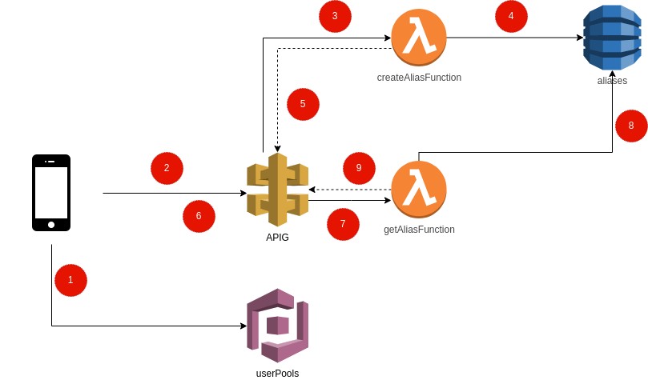

# Introdução
O objetivo este exercício é o de criar uma aplicação real na AWS. Este exercício será quebrado em objetivos menores e você só deverá ir para o próximo exercício quando terminar e testar o exercício anterior.

# Antes e começar
Para esse exercício estamos deixando uma Cognito UserPools já configurada para você usar para criar sua aplicação.

## Objetivo 1
### Arquitetura


### Descrição
1. Aplicação criar/loga usuário usando URL de autenticação do cognito (veja Output **BitlyAuthURL**). Após se logar, o domínio do cognito chamará a URL de callback que redirecionará para a aplicação do cliente com os seguintes query parameters: **id_token**, **expires_in** e **token__type**.
2. Após o login, a aplicação faz uma chamada de **POST** para o APIG com as seguintes informações:

```
POST /alias
HEADERS
  Authorization: id_token
DATA:
    {
        "data": {
            "url" "http://abc.com.br"
        }
    }
```

3. Se o token de authenticação for válido, o APIG chama a Lambda **createAliasFunction**. Essa Lambda criará um valor aleatório de 8 caracteres e verificará se esse valor não existe no DynamoDB **aliases**. Se existir, ela deverá gerar outro valor.
   - A Lambda deverá pegar o evento enviado pelo API Gateway para validar o grupo do usuário no cognito e se ele está verificado.
4. Se o valor não existir, a lambda **createAliasFunction** deverá salvar o dado no DynamoDB com o seguinte formato:

```json
{
    "alias": "string de 8 caracteres",
    "url": "url para onde a API deverá redirecionar",
    "uuid": "sub/uuid do usuário cognito",
    "type": "PAID/FREE (lambda deverá pegar o grupo do usuário para definir esse valor)"
}
```

5. **CreateAliasFunction** retorna um body com o caminho que o usuário deverá acessar para chamar a URL encurtada:

```json
{
    "data": {
        "alias": "https://{domínio_do_APIG}/{alias}"
    }
}
```

6. Usuário acessa a URL retornada pelo passo anterior (https://{domínio_do_APIG}/{alias}). Essa URL será um caminho de **GET**
no API Gateway.
7. APIG chama a funçãoo **getAliasFunction** para procurar o alias.
8. **getAliasFunction** procurar o alias no Redis **aliasCache**. Se a achar ali, ela retorna o código HTTP 301 com a URL
para qual ela deverá redirecionar.
9. Se **getAliasFunction** não achar o alias em **aliasCache**, ele pesquisará em **aliases**. Se o achar, ele
irá salvar o alias em **aliasCache** e depois redirecionar para a URL salva.
10. Para redirecionar, a Lambda deverá retornar a seguinte saída:

```json
{
    "statusCode": 301,
    "headers": {
        "Location": "{{url encontrada}}"
    }
}
```