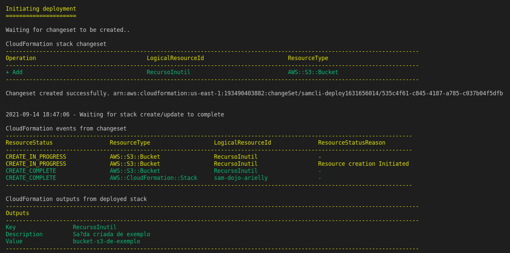

# Introdução
Este arquivo de README foi criado para ajudar o estudante no setup inicial para começar os exercícios e para apresentar como rodar este template em sua conta AWS.

## Configurando sua máquina
### 1. Criando uma conta na AWS
[Este tutorial](https://aws.amazon.com/pt/premiumsupport/knowledge-center/create-and-activate-aws-account/) apresenta como você pode criar uma conta na AWS.

### 2. Ativando suas credenciais na AWS
[Este tutorial](https://docs.aws.amazon.com/pt_br/powershell/latest/userguide/pstools-appendix-sign-up.html) apresenta como você pode criar sua credenciais AWS. Guarde essas informações porque elas serão usadas no [passo 3](#3-configurando-o-aws-cli-em-sua-máquina).

### 3. Configurando o AWS CLI em sua máquina

1. Instale o [AWS CLI](https://docs.aws.amazon.com/pt_br/cli/latest/userguide/install-cliv2.html).
2. Crie um [perfil](https://docs.aws.amazon.com/pt_br/cli/latest/userguide/cli-configure-profiles.html) para sua conta. O perfil criado deverá possuir o seguinte formato:

```
[<<NOME_DO_SEU_PERFIL>>]
aws_access_key_id=<<CHAVE DE ACESSO CRIADA NO [PASSO 2](#2-ativando-suas-credenciais-na-aws)>>
aws_secret_access_key=<<CHAVE DE ACESSO SECRETA CRIADA NO [PASSO 2](#2-ativando-suas-credenciais-na-aws)>>
region=us-east-1
```

Após configurar seu perfil, você poderá usá-lo com `export AWS_PROFILE=<<NOME_DO_SEU_PERFIL>>` em seu terminal para rodar comando com o AWS CLI e com o AWS SAM.

**OBS.:** Outra opção pode ser o uso de variáveis de ambiente para acessar seu ambiente. Em alguns casos isso se torna necessário porque a conta AWS fornece chaves temporárias para acesso em uma dada conta. Nesse caso use [este tutorial](https://docs.aws.amazon.com/pt_br/cli/latest/userguide/cli-configure-envvars.html#envvars-set).

### 4. Instalando o SAM CLI
Use [o guia oficial da AWS](https://docs.aws.amazon.com/serverless-application-model/latest/developerguide/serverless-sam-cli-install.html) para instalar o AWS SAM em sua máquina.

#### 4.1 Validar a instalação do AWS CLI
1. Adicione as credenciais de seu ambiente (veja [Configurando o AWS CLI em sua máquina](#3-configurando-o-aws-cli-em-sua-máquina)).
2. Rode o comando `aws s3 ls` e veja se os buckets S3 desta conta aparecem.

#### 4.2 Validar instalação do SAM
1. Adicione as credenciais de seu ambiente (veja [Configurando o AWS CLI em sua máquina](#3-configurando-o-aws-cli-em-sua-máquina)).
2. Dentro desta pasta, rode `sam validate`.

### 5. Crie um Bucket S3 em sua conta AWS para poder rodar a build de sua aplicação SAM
1. Utilize [este tutorial](https://docs.aws.amazon.com/pt_br/AmazonS3/latest/userguide/creating-bucket.html) para criar seu Bucket S3. Você deverá utilizar este Bucket S3 toda vez que for rodar os passos mencionados em [Rodando este projeto](#rodando-este-projeto).

## Rodando este projeto
Este diretório possui o arquivo [template.yaml](./template.yaml) que possui um exemplo básico de template SAM para que você possa utilizar para começar seus exercícios. **Antes de começar, rode os seguintes comandos para validar seu ambiente**:

```sh
sam build --template template.yaml --build-dir .aws-sam/build

sam package --template-file .aws-sam/build/template.yaml --output-template-file .aws-sam/build/packaged-template.yaml --s3-bucket <bucket-criado-no-passo-5-de-configurando-minha-maquina> --s3-prefix <seu_nome>

sam deploy --template-file .aws-sam/build/packaged-template.yaml --stack-name sam-dojo-<seu_nome> --no-fail-on-empty-changeset --s3-prefix <seu_nome> --capabilities CAPABILITY_IAM CAPABILITY_NAMED_IAM
```

Você saberá que sua **Stack do CloudFormation** foi executada com sucesso se a saída dos passos acima for:



**OBS.:** Caso a saída do seu comando falhe, verifique se o nome do bucket do template já existe. Se já existir, mude a propriedade **BucketName** em [template.yaml](./template.yaml) e tente de novo.

### Verificando os recursos criados por sua Stack do CloudFormation
Você pode ver o resultado de sua stack do CloudFormation no console da AWS.
1. Para isso, logue no console da AWS e acesse o menu [CloudFormation](https://console.aws.amazon.com/cloudformation/home).
2. Procure pela sua stack criada `sam-dojo-<<seu_nome>>`.
3. Clique na Stack.
4. Acesse a aba Recursos (Resources).
5. Nessa tela você poderá ver todos os recursos criados pela sua Stack de CloudFormation.

## Começando os exercícios
Na [estrutura inicial do projeto](../README.md) temos os exercícios planejados para esse treinamento. **Todos os exercícios devem ser resolvidos no [template](./template.yaml) desta pasta e aplicados na nuvem da AWS utilizando os comando mencionados no passo [rodando este projeto](#rodando-este-projeto)**. No final de cada exercício você deverá rodar o [teste](#validando-sua-solução) referente a esse exercício para garantir que sua solução funcionou. Se ele passar, você poderá prosseguir para o próximo exercício.

## Validando sua solução
(TODO)